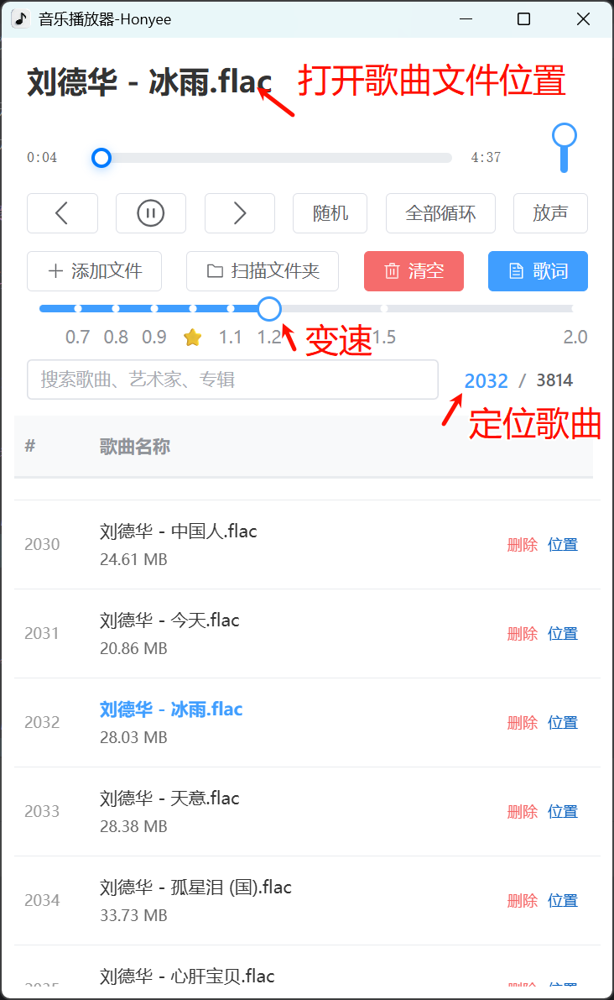

# 🎵 音乐播放器

使用 Electron + Vue 3 + TypeScript + FFmpeg 构建的音乐播放器。

## ✨ 功能特性

自用播放器，功能简洁，主要实现如下功能：

- 歌曲无损变速
- 导入大量（几千首）歌曲时播放不卡顿



## 安装和运行

### 环境要求

- Node.js >= 18.0.0
- npm >= 8.0.0

### 安装依赖

```bash
npm install
```

### 开发模式

```bash
npm run dev
```

### 构建应用

```bash
# 构建所有平台
npm run build

# Windows
npm run build:win

# macOS
npm run build:mac

# Linux
npm run build:linux
```
